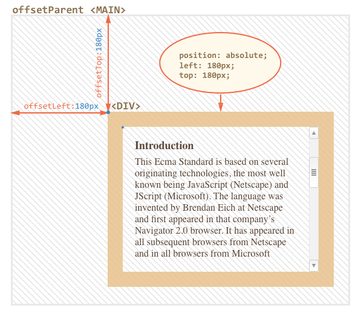
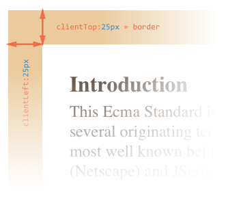
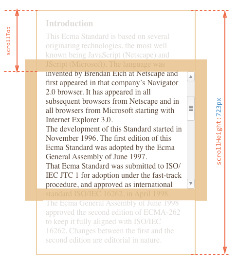

# 前端开发 - CSS 页面布局

## 目录

- [Q: HTML5 行内元素有哪些，块级元素有哪些，空元素有哪些?](#q-html5-行内元素有哪些块级元素有哪些空元素有哪些?)
- [Q: HTML5 有哪些新特性?](#q-HTML5-有哪些新特性?)
- [Q: HTML5 的存储方案有哪些?](#q-HTML5-的存储方案有哪些?)
- [Q: native页面和H5页面的区别](#q-native页面和H5页面的区别)
- [Q: 如何获取浏览器窗口的可见宽高?](#q-如何获取浏览器窗口的可见宽高?)
- [Q: 如何理解getBoundingClientRect?](#q-如何理解getBoundingClientRect?)
- [Q: offsetWidth/offsetHeight、clientWidth/clientHeight 和 scrollWidth/scrollHeight 之间的区别](#q-offsetwidthoffsetheightclientwidthclientheight-和-scrollwidthscrollheight-之间的区别)
- [Q: relative 和 absolute 分别是相对于谁进行定位的?](#q-relative-和-absolute-分别是相对于谁进行定位的)
- [Q: 如何理解BFC?](#q-如何理解BFC?)
- [Q: 什么是CSS盒模型?](#q-什么是-CSS-盒模型?)
- [Q: 如何理解CSS中的float属性?](#q-如何理解CSS中的float属性?)
- [Q: 如何理解CSS中的display属性?](#q-如何理解CSS中的display属性?)
- [Q: 如何去除inline-block元素间距?](#q-如何去除inline-block元素间距?)
- [Q: 如何理解list-style:none outside none的作用](#q-如何理解list-style:none-outside-none的作用)
- [Q: 如何居中布局?](#q-如何居中布局?)
- [Q: 如何实现绝对居中布局?](#q-如何实现绝对居中布局?)
- [Q: 如何用纯css实现小箭头?](#q-如何用纯css实现小箭头?)
- [Q: 如何进行px与em的换算?](#q-如何进行px与em的换算?)

### Q: HTML5 行内元素有哪些，块级元素有哪些，空元素有哪些?

1. 行内元素有：a、span、button、input、select、textarea、i、em、strong
2. 块级元素
    - 2.1. 布局类: div、section、header、footer、aside、nav、article等
    - 2.2. 列表类: ul、li、ol
    - 2.3. form、p、table、标题h1~h6
3. 空元素: br、hr

### Q: HTML5 有哪些新特性?

1. 语义化标签: header、footer、nav、aside、article、section 等
2. 增强表单: 为 input 增加 color、email、date、range 等类型
3. 存储方面: 提供了 sessionStorage 、localStorage 和离线存储
4. 多媒体方面: 规定了音频和视频元素audio和video
5. 还有地理定位、canvas画布、拖放、多线程编程的 web workers 和 websocket 协议

### Q: HTML5 的存储方案有哪些?

1. HTML5提供了 sessionStorage、localStorage 和 离线存储
2. sessionStorage 和 localStorage 都是采用键值对的形式存储，通过 setItem、getItem、removeItem 来实现增删查改
3. sessionStorage 是会话存储，当浏览器关闭之后，自动清空
4. localStorage 没有时间上的限制，当浏览器关闭之后，不会自动清空
5. 离线存储用来确保 web 应用能够在离线情况下使用，通过在html标签中属性manifest来声明需要缓存的文件
6. manifest 文件声明的缓存文件可在初次加载后缓存在客户端，可以通过更新这个 manifest 文件来达到更新缓存文件的目的

### Q: native页面和H5页面的区别

* native页面

优势：
1. 运行速度比较快
2. 能使用设备的底层功能，如摄像头、方向传感器、重力传感器、拨号、GPS、语音、短信、蓝牙等
3. 在界面设计、功能模块、操作逻辑等层面相较 web 更易做到 App 的便捷性和舒适性，功能更加强大
4. 节省流量

劣势：
1. 不同的操作系统（如 Android 和 iOS）需要独立的进行开发
2. 每次有更新，都需要重新打包一次发布到应用平台上，且每次要向各个应用商店进行提交审核。之后用户需要手动进行点击更新安装（安装成本较高）
3. 开发成本比较高，尤其需要适配各种机型时（如 Android 应用，需要适配各种 Android 手机）

* H5 页面

优势：
1. 由于是运行在浏览器上，所以只需要开发一次便可以在不同的操作系统上显示
2. 迭代版本时，不需要打包便可以发布（实时更新、快速迭代），与云端实现实时数据交互
3. 开发成本相对较低，对浏览器的适配较简单，且发布门槛相对较低

劣势：
1. 每次打开页面，都得重新加载，获取数据
2. 过于依赖网络，速度无法保证。特别在弱网环境下，不仅耗费流量而且加载缓慢，就算是 WiFi 情况下也不容乐观
3. 只能使用有限的设备底层功能（无法使用摄像头、方向传感器、重力传感器、拨号、GPS、语音、短信、蓝牙等功能）
4. 仍处于发展阶段，部分功能无法在基于现有技术的浏览器基础上实现，且无法全面的显示最完美的用户体验，只能用现有技术去弥去找最佳解决方案

### Q: 如何获取浏览器窗口的可见宽高?

1. 浏览器窗口的尺寸(就是内容部分，可见的部分，不包括工具栏和滚动条)
2. 对于IE、Chrome、Firefox、Opera 以及 Safari
```
window.innerWidth: 浏览器窗口的可见宽度
window.innerHeight: 浏览器窗口的可见高度
```
3. 对于 IE 8、7、6、5
```
document.documentElement.clientHeight
document.documentElement.clientWidth
或者
document.body.clientHeight
document.body.clientWidth
```
4. 兼容所有浏览器
```
var w = window.innerWidth || document.documentElement.clientWidth || document.body.clientWidth;

var h = window.innerHeight || document.documentElement.clientHeight || document.body.clientHeight;
```

### Q: 如何理解getBoundingClientRect?

1. getBoundingClientRect()返回一个矩形对象，包含四个属性：top，right, bottom, left，分别表示元素各边与页面上边和左边的距离
2. 在IE中，默认坐标从(2,2)开始计算，导致最终距离比其他浏览器多出两个像素
```
function getRect (element) {
    var rect = element.getBoundingClientRect();
    var top = document.documentElement.clientTop; // 非IE为0，IE为2
    var left= document.documentElement.clientLeft; // 非IE为0，IE为2
    return {
        top    :   rect.top - top,
        bottom :   rect.bottom - top,
        left   :   rect.left - left,
        right  :   rect.right - left
    }
}
// width: rect.width || right - left;
// Height: rect.height || bottom - top;
```
3. 获取页面元素的位置
```
var X = this.getBoundingClientRect().left + document.documentElement.scrollLeft;

var Y = this.getBoundingClientRect().top + document.documentElement.scrollTop;
```

### Q: offsetWidth/offsetHeight、clientWidth/clientHeight 和 scrollWidth/scrollHeight 之间的区别

1. offsetWidth/offsetHeight 返回值包含 content + padding + border + 滚动条，效果与ele.getBoundingClientRect()相同
2. clientWidth/clientHeight 返回值只包含 content + padding，如果有滚动条，也不包含滚动条
3. scrollWidth/scrollHeight 返回值包含 content + padding + 溢出内容的尺寸(因滚动被隐藏的部分)

* offsetWidth / clientWidth / scrollWidth


* offsetParent / offsetLeft / offtsetTop



* clientLeft / clientTop (内部与外部的相对坐标 / border)



* scrollTop / scrollHeight

1. 元素的 scrollTop 值是这个元素的顶部到它的最顶部可见内容的顶部的距离的度量
2. 大多数几何结构属性都是只读的，但是 scrollLeft 和 scrollTop 是可更改的
3. 如果将 scrollTop 设置为 0 或 Infinity 将会使元素分别滚动到浏览器的最顶端和最底端



* 几何结构


```
#contentDiv {
  width: 300px;
  height: 200px;
  border: 25px solid #E8C48F;
  padding: 20px;
  overflow: auto;
}
1. 如果没有滚动条，内容（content）的 width 将是300px
2. 如果滚动条的宽度是16px（不同的设备和浏览器的宽度不同），那么内容的 width 将是300 - 16 = 284px
3. 那么 clientWidth = 2 * padding + width = 2 * 20 + 284 = 324
```

### Q: relative 和 absolute 分别是相对于谁进行定位的？

1. absolute: 相对于最近一级的定位不是 static 的父元素来进行定位，如果没有，就是相对于根元素，有z-index属性，脱离正常文档流
2. fixed: 相对于浏览器窗口或 frame 进行定位，是特殊的absolute，总是以body为定位对象的，即使拖动滚动条，元素的位置也是不会改变的，有z-index属性，脱离正常文档流
3. relative: 相对于正常文档流中的位置进行定位，有z-index属性，relative的偏移是基于对象的margin的左上侧的
4. static: 默认值。没有定位，元素出现在正常文档流中，top，right，bottom，left等属性不会被应用
5. sticky: 容器的位置根据正常文档流计算得出
6. 所谓的文档流，指的是元素排版布局过程中，元素会自动从左往右，从上往下的流式排列
7. 脱离文档流，指的是元素从普通的布局排版中脱离，其他盒子会填补脱离了文档流元素的原本位置而进行定位

* z-index

1. z-index，又称为对象的层叠顺序，它用一个整数来定义堆叠的层次，整数值越大，则被层叠在越上面，这是指同级元素间的堆叠
2. 如果两个对象的此属性具有同样的值，那么将依据它们在HTML文档中流的顺序层叠，写在后面的将会覆盖前面的
3. 父子关系是无法用z-index来设定上下关系的，一定是子级在上父级在下
4. 使用static 定位或无position定位的元素z-index属性是无效的

* relative

```
<div id="parent">
     <div id="sub1">sub1</id>
     <div id="sub2">sub2</id>
</div>

#sub1
{
    position: relative;
    top: 5px;
    left: 5px;
}

1. relative属性是相对于元素本身的位置来进行偏移的
2. 当设置sub1的position为relative后，它依然还在正常文档流中，占有文档空间，它将根据top，right，bottom，left的值按照它理应所在的位置进行偏移
3. 此时sub2不会因为sub1增加了relative的属性而发生改变，如果sub1设置margin/padding，就会让sub1和sub2的文档空间产生偏移
4. 如果此时把sub2的position也设置为relative后，它和sub1一样，按照它原来理应应在的位置进行偏移
5. relative和static方式在最外层时是以<body>标签为定位原点的
```

* absolute

```
1. 当sub1的position设置为absolute后，sub1会溢出正常的文档流，如果此时parent也设置了position属性，且position的属性值为absolute或者relative时，sub1按照这个parent来进行定位
2. 如果parent设定了margin，border，padding等属性，那么这个 定位点 将忽略padding，将会从padding开始的地方(即只从padding的左上角开始)进行定位，但并不会忽略margin和border，总结一下，就是absolute是根据祖先类的border进行定位的
3. 此时sub2将获得sub1的位置（因为sub1溢出了正常的文档流，不在同一层，空出了位置），它的文档流不再基于sub1，而是直接从parent开始
4. 如果设置了position为absolute的sub1不存在一个有着position属性的父对象，那么它就会以<html>作为原点定位
5.  使用absoulte或fixed定位的话，必须指定 left、right、 top、 bottom 属性中的至少一个，否则left/right/top/bottom属性会使用它们的默认值 auto ，这将导致对象遵从正常的HTML布局规则，都变成relative，会占用文档空间，很多人使用absolute定位后发现没有脱离文档流就是这个原因
6.  如果top和bottom一同存在的话，那么只有top生效
7.  如果left和right一同存在的话，那么只有left生效
8.  绝对(absolute)定位对象在可视区域之外会导致滚动条出现
9.  相对(relative)定位对象在可视区域之外，滚动条不会出现
```

### Q: 如何理解BFC?

1. BFC: Block Formatting Context 直译为 "块级格式化上下文"
2. BFC是一个页面上的独立的容器，外面的元素不会影响BFC里的元素，反过来，里面的也不会影响外面的
3. 属于同一个BFC的两个相邻box的margin会发生重叠
4. 创建BFC
    1. float属性不为none（脱离文档流）
    2. position为absolute或fixed
    3. display为inline-block,table-cell,table-caption,flex,inine-flex
    4. overflow不为visible
    5. 根元素
5. 应用场景
    1. 自适应两栏布局
    2. 清除内部浮动 
    3. 防止垂直margin重叠

### Q: 什么是 CSS 盒模型?

* 标准盒子模型


* IE盒子模型


1. CSS中的盒子模型包括 IE盒子模型 和 标准的W3C盒子模型
2. box-sizing 有3个值：border-box, padding-box, content-box
3. 在标准盒子模型中，width指 content 部分的宽度
4. 在IE盒子模型中，width表示 content+padding+border 这三个部分的宽度
5. CSS3中引入了 box-sizing 属性，```box-sizing:content-box;```表示标准的盒子模型，```box-sizing:border-box;```表示的是IE盒子模型

### Q: 如何理解CSS中的float属性?

1. 浮动元素块状化：块状化是指可以像块元素一样设置宽和高，但并不是真正的块元素
```
<div style="height: 200px; width: 200px;"> 
    <span style="float: left; width: 150px; height: 150px;>浮动元素span</span> 
</div>
```
2. 高度塌陷：因为浮动元素脱离了正常的文档流，父元素的高度并没有被子元素撑开，父元素被认为没有子元素，所以产生了高度塌陷
3. 在CSS中可以使用```clear:both```来清除float属性带来高度塌陷等问题
4. clear属性：元素盒子的边不能和**前面的**浮动元素相邻，也就是说clear属性对**后面的**浮动元素是不闻不问的
5. clear属性只能清除浮动对元素自身带来的影响，不能影响其他的元素
6. 由于clear属性的本质是让元素自身不和float元素在一行显示，并不是真正意义上的清除浮动，如果设置了```clear:both```的元素的前面是float元素，则其设置margin-top是无效的
7. 在实际工作中，我们常常使用下面的代码来清除浮动带来的影响
```
.clearfix:after {
    content: " ";
    display: block;
    height: 0;
    line-height: 0;
    font-size: 0;
    clear: both;
    visibility: hidden;
}
.clearfix { *zoom:1;}
// 这是针对于IE6的，因为IE6不支持:after伪类
// zoom:1 让IE6的元素可以清除浮动来包裹内部元素
```
8. 使用BFC来清除浮动，添加```overflow：hidden```
9. ```overflow：hidden```的含义是超出的部分要裁切隐藏，float的元素虽然不在普通流中，但它是浮动在普通流之上的，可以把普通流元素和浮动元素想象成一个立方体。如果在没有明确设定包含容器高度的情况下，它要计算内容的全部高度才能确定在什么位置hidden，这样浮动元素的高度就要被计算进去。这样包含容器就会被撑开，达到清除浮动的效果
10.  浮动元素后的非浮动元素问题
        1. 浮动元素后边的元素若是 非浮动行内元素 且在定位后产生重叠时，行内元素边框、背景和内容(文本)都在该浮动元素"之上"显示
        2. 浮动元素后边的元素若是 非浮动块级元素 且在定位后产生重叠时，块级元素边框和背景都在该浮动元素"之下"显示，内容(文本)在浮动元素"之后"显示
11. 文字排版时会将浮动元素当作还存在于文档流中，可以产生文字环绕效果。可理解为文档流在最下一层，文本流和浮动元素同在上一层，故元素浮动后，后面的元素内的文字不会覆盖到浮动元素上面，而是环绕 

### Q: 如何理解CSS中的display属性?

* display:none

1. display:none: 该对象被隐藏且在页面上彻底消失，看不见也摸不到
2. visible:hidden: 该对象被隐藏但在页面上所占的空间不变，看不见但摸得到

* display:block

1. 此元素将显示为块级元素，前后带有换行符
2. 块级元素特点
    1. 占领一整行。若干同级块元素会从上之下依次排列（使用float属性除外）
    2. 可以设置高度、宽度、margin、padding
    3. 当宽度（width）缺省时，它的宽度时其容器的100%，除非我们给它设定了固定的宽度
    4. 块级元素中可以容纳其他块级元素或行内元素
    5. 常见的块级元素有```<p><div><h1><ul><li>```等等
    6. 块级元素的display属性值默认为block
3. 行内元素特点
    1. 它不会单独占据一整行，而是只占领自身的宽度和高度所在的空间。若干同级行内元素会从左到右（即某个行内元素可以和其他行内元素共处一行），从上到下依次排列
    2. 行内元素不可以设置高度、宽度，其高度一般由其字体的大小来决定，其宽度由内容的长度控制
    3. 行内元素只能设置左右的margin值和左右的padding值，而不能设置上下的margin值和上下的padding值
    4. 常见的行内元素有```<a><span><input><strong>```等等
    5. 行内元素一般不可以包含块级元素
    6. 块级元素的display属性值默认为inline
    7. 通过对一个行内元素设置```display:block;```可以将一个行内元素设置为块级元素，进而设置它的宽高和上下左右的margin和padding（比如导航栏中的行内元素```<a>```）

* display:inline

1. 此元素会被显示为内联元素，前后没有换行符
2. 通过对一个行内元素设置```display:inline;```可以将一个块级元素转换成行内元素，那么这个块级元素将不能再设置宽和高以及上下方向的margin和padding

* display：inline-block

1. 设置了```display:inline-block;```属性的元素，既具有block元素可以设置width和height属性的特性，又保持了inline元素不换行的特性
2. 做横向导航菜单的时候，一般是用ul li a组合，然后将li设置为float，将a设置为```display:block;```。而现在我们可以通过将li设置```display:inline-block;```来实现
```
ul,li,a,* {padding:0;margin:0;list-style: none;text-decoration: none;}
li {display: inline-block;border: thin solid red;}

<ul>
    <li><a href="">home</a></li>
    <li><a href="">about</a></li>
</ul>
```
3. 虽然实现了横向的排列，而且padding和margin的值都设置为0，但导航菜单之间还是会有空隙（[home]<空白符>[about]）
4. 解决inline/inline-block元素产生的空白符问题
    1. 这些空隙是空白符，在浏览器中，空白符是不会被浏览器忽略的，多个连续的空白符浏览器会自动将其合并成一个
    2. 我们编写代码时写的空格，换行都会产生空白符。如果将上述例子中的a标签写成一行，空白符消失，菜单之间也就紧凑起来了
    3. 空白符归根结底是一个字符，只要我们将ul中的字符的大小设置为０，那么空白符也就不会存在了
    4. 但是a的字体大小也会继承ul的字体大小，那么就会不见了，所以还需要为a再设置一个字体不为0的大小来覆盖
```
ul {font-size: 0;}
ul,li,a,* {padding:0; margin:0;list-style: none;text-decoration: none;}
li {display: inline-block;border: thin solid red;font-size: 15px;}
```

```
// 解决inline空白符问题
<div class="main">
    <div class="test">123</div>
    <div class="test">abc</div>
</div>

<style>
html{
  -webkit-text-size-adjust:none;/* 使用webkit的私有属性，让字体大小不受设备终端的调整，可定义字体大小小于12px */
}
.main{
  font-size:0;
  *word-spacing:-1px;/* 使用word-spacing 修复 IE6、7 中始终存在的 1px 空隙，减少单词间的空白（即字间隔） */
}
.test{
  display:inline;
  width: 10000px;
  height:10000px;
  border:1px solid;
  font-size:12px;
  letter-spacing: normal;/* 设置字母、字间距为0 */ 
  word-spacing: normal; /* 设置单词、字段间距为0 */
}
</style>
```

* display：flex

1. flex是一种弹性布局属性，设为Flex布局以后，子元素的float、clear和vertical-align属性将失效
2. 主要属性有两大类：flex-container容器属性和flex-item项目属性
3. flex-container属性
    1. flex-direction: 用来控制子项整体布局方向，是从左往右还是从右往左，是从上往下还是从下往上
    2. flex-wrap: 用来控制子项整体单行显示还是换行显示，如果换行，则下面一行是否反方向显示
    3. flex-flow: 是flex-direction和flex-wrap的缩写```flex-flow: <‘flex-direction’> || <‘flex-wrap’>```，默认值为row nowrap
    4. justify-content: 决定了水平方向子项的对齐和分布方式
    5. align-items: 决定了flex子项们相对于flex容器在垂直方向上的对齐方式
    6. align-content: 定义垂直方向每一行flex元素的对齐和分布方式
4. flex-item属性
    1. order: 定义项目的排列顺序。数值越小，排列越靠前，整数值，默认为0
    2. flex-grow: 定义项目的放大比例，默认为0，即如果存在剩余空间，也不放大
    3. flex-shrink: 定义项目的缩小比例，默认为1，即如果空间不足，该项目将缩小
    4. flex-basis: 定义了在分配剩余空间之前元素的默认大小。默认值是auto，就是自动。有设置width则占据空间就是width，没有设置就按内容宽度来
    5. flex: 是flex-grow, flex-shrink 和 flex-basis 的简写，默认值为0 1 auto。后两个属性可选
    6. align-self: 允许单个项目有与其他项目不一样的对齐方式，可覆盖align-items属性。默认值为auto，表示继承父元素的align-items属性，如果没有父元素，则等同于stretch

### Q: 如何去除inline-block元素间距?

1. 内联元素会被当做字体来处理的，字体之间是有间隔的，所以内联元素之间也是有间隔的
2. 解决方法：在父级元素上设置属性```font-size:0```清除```display:inline-block```元素换行符间隙
3. 重新设置子级元素的字体大小

```
<div style="font-size:0;">
    <input type="text" name="" id="" value="">
    <button>submit</button>
</div>
```

### Q: 如何理解```list-style:none outside none;```的作用

1. 当ul浮动后```float: left;```，需要加上```display:inline;```来解决在IE6中的双倍边距问题
```
.ul { float:left; display:inline; }
.ul li { list-style:none; }
```
2. 以上CSS设置，在FF、ie8下面显示正常，列表符隐去不见，li里面的内容与框之间没有距离
3. 但是在ie6、ie7里面虽然也会隐去列表符，但还会保留列表符在li里面所占的位置
4. 造成ie6、ie7这种效果差别，可能是因为属性```list-style-position：inside;```是他们的默认值，即使设置了```list-style:none;```
5. 在 CSS Reset 的时候使用 ```list-style:none outside none;``` 更好

### Q: 如何居中布局?

```
div {
    position: absolute;
    width: 100px; // 需要设置元素宽度才能居中
    height: 100px;
    line-height: 100px; //设置line-height与height高度相同，使得文字在块内垂直居中
    text-align: center; //文字水平居中
    margin: auto;
    top: 0;
    right: 0;
    bottom: 0;
    left: 0;
}
// 当一个绝对定位元素，其定位方向属性(top,right,bottom,left)同时有具体定位数值的时候，流体特性就发生了
// 具有流体特性绝对定位元素的 margin:auto 的填充规则和普通流体元素一样
```

* translate

```
transform: translate(x轴平移，y轴平移)
transform: translateX(xxx)
transform: translateY(yyy)
transform: translateZ(zzz)
如果只设置transform: translate(xxx)，那么只会在 X轴 进行平移

div {
  transform: translate(50px,100px);
  -ms-transform: translate(50px,100px);		/* IE 9 */
  -webkit-transform: translate(50px,100px);	/* Safari and Chrome */
  -o-transform: translate(50px,100px);		/* Opera */
  -moz-transform: translate(50px,100px);		/* Firefox */
}

```

**注意**：translate平移之后不会将正常文档流中的元素挤开

* translate(-50%,-50%)实现居中

```
<!--html-->
<body>
<div>这是用来测试的</div>
</body>

/*CSS*/
div{
  position:absolute;
  top:50%;
  left:50%;
  border-radius: 5px;
  -webkit-transform:translate(-50%, -50%);
     -moz-transform:translate(-50%, -50%);
          transform:translate(-50%, -50%);
}
// translate(x,y) 括号的百分比数据，会以 本身的宽高 做参考
// 比如，本身的宽为100px，高为100px. 那填(50%,50%)就是向右，向下移动50px，添加负号就是向着相反的方向移动
```

### Q: 如何实现绝对居中布局?

* 已知div块的宽度和高度

```
// 用负margin等于宽高的一半来进行居中
div {
  position: absolute;
  top: 50%;
  left: 50%;
  margin-top: -50px;
  margin-left: -50px;
  width: 100px;
  height: 100px;
}
```

```
// 用margin:auto来进行居中
div {
  position: absolute;
  width: 100px;
  height: 100px;
  margin: auto;
  top: 0;
  right: 0;
  bottom: 0;
  left: 0;
}
```

* 不知道要进行绝对居中的元素的宽度和高度

```
div {
  position: absolute;
  top: 50%;
  left: 50%;
  -webkit-transform:translate(-50%, -50%);
     -moz-transform:translate(-50%, -50%);
          transform:translate(-50%, -50%);
}
```

### Q: 如何用纯css实现小箭头?

三角形原理：一个高宽相等的正方形，选取你所需要的某一边，截取出来的是一个梯形，当高宽都为0，且其他边为透明颜色时，一个三角形就出来了

```
width:0;
height:0;
border: 10px solid transparent;
border-left-color: orange; // 向右的箭头
```

三角线箭头原理：设置两个伪类，前一个伪类覆盖至另一个了伪类，留出一些线出来就好

```
.arrow:after,
.arrow:before {
    width: 0;
    height: 0;
    border: 10px solid transparent;
    border-left-color: orange;
    position: absolute;
    content: "";
}
.arrow:before{
    top: 0;
    left: 70px; // 根据实际情况调整
    border-left-color: white;
}
```

### Q: 如何进行px与em的换算?

* px 绝对长度单位，是相对于显示器屏幕分辨率而言的

1. IE无法调整那些使用px作为单位的字体大小
2. 国外的大部分网站能够调整的原因在于其使用了em或rem作为字体单位

* em 相对长度单位，是相对于当前对象内文本的字体尺寸(font-size)而言的

1. em的值并不是固定的
2. em会继承父级元素的字体大小（参考物是父元素的font-size）
3. em中所有的字体都是相对于父元素的大小决定的：如果一个设置了```font-size:1.2em```的元素在另一个设置了```font-size:1.2em```的元素里，那么它的字体大小为 1.2*1.2=1.44em
```
<div class="big">我是大字体
    <div class="small">我是小字体</div>
</div>

<style>
    body {font-size: 62.5%; } /*  公式:16px*62.5%=10px  1em=10px*/
    .big {font-size: 1.2em}
    .small {font-size: 1.2em}
</style>

// small的字体大小为：1.2em*1.2em=1.44em
```

* rem是CSS3新增的一个相对长度单位（root em）

1. 使用rem为元素设定字体大小时，仍然是相对大小，但相对的只是HTML根元素
2. 通过它既可以做到只修改根元素就成比例地调整所有字体大小，又可以避免像em那样字体大小逐层复合的连锁反应
```
<div class="big">我是14px=1.4rem
    <div class="small">我是12px=1.2rem</div>
</div>

<style>
    html {font-size: 10px;} /*  公式16px*62.5%=10px  1rem=10px*/
    .big {font-size: 1.4rem}
    .small {font-size: 1.2rem}
</style>

// small的字体大小为：1.2em*10=12px
```
3. 除了IE8及更早版本外，所有浏览器均已支持rem

* em与px的换算

1. 一般来说，浏览器的默认字体高度16px，所有未经调整的浏览器都符合: 1em=16px，那么 10px=0.625em
2. 为了简化font-size的换算，在css中的body选择器中写入以下代码
```
body {font-size: 62.5%;} /*  公式16px*62.5%=10px  */  
```
3. 这就使 1em = (16px * 62.5%) = 10px
4. 也就是说只需要将你的原来的px数值除以10，然后换上em作为单位就行了
