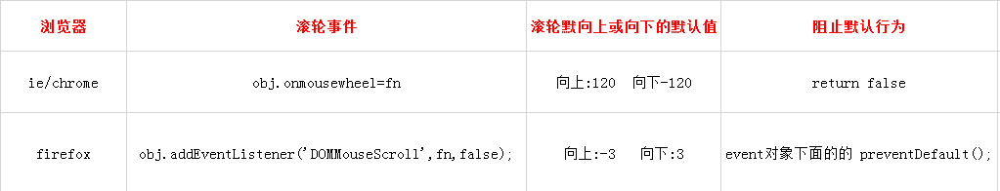

# 前端开发 - Javascript 开发

## 目录
- [面试中提问的问题](#面试中提问的问题)
- [JavaScript 相关](#JavaScript-相关)
- [服务器相关](#服务器相关)

### 面试中提问的问题

1. 问清楚公司做的什么产品，以后的发展方向
2. 问清楚公司的技术团队，技术栈
3. 问清楚自己如果入职了，自己的工作内容是什么
4. 问清楚公司的上班时间，上班地点，试用期情况，薪资福利，薪资发放时间，五险一金
5. 拿到 offer 后查清楚公司的企业信息，如：企查查就可以查

### JavaScript 相关

- [Q: Undefined 和 Null 的区别](#q-Undefined-和-Null-的区别)
- [Q: JS中typeof的返回值类型有哪些](#q-JS中typeof的返回值类型有哪些)
- [Q: JS中数据类型的布尔值及其比较](#q-JS中数据类型的布尔值及其比较)
- [Q: 如何理解ES6中的新数据类型Symbol](#q-如何理解ES6中的新数据类型Symbol)
- [Q: 如何理解ES6中的Map](#q-如何理解ES6中的Map)
- [Q: 如何理解ES6中的Module](#q-如何理解ES6中的Module)
- [Q: for of 与 for in的区别](#q-for-of-与-for-in的区别)
- [Q: mouseover 和 mouseenter 的区别](#q-mouseover-和-mouseenter-的区别)
- [Q: setTimeout、setInterval 和 requestAnimationFrame 之间的区别](#q-settimeoutsetinterval-和-requestanimationframe-之间的区别)
- [Q: 如何理解事件绑定的兼容性问题](#q-如何理解事件绑定的兼容性问题)
- [Q: 如何理解鼠标滚轮事件的兼容性问题](#q-如何理解鼠标滚轮事件的兼容性问题)
- [Q: 如何实现一个 bind 函数](#q-如何实现一个-bind-函数)
- [Q: 如何实现一个 call 函数](#q-如何实现一个-call-函数)
- [Q: 如何实现一个 apply 函数](#q-如何实现一个-apply-函数)
- [Q: 如何实现一个 instanceof 函数](#q-如何实现一个-instanceof-函数)
- [Q: 如何理解箭头函数中的this](#q-如何理解箭头函数中的this)
- [Q: window.onload 和 document.ready 的区别](#q-windowonload-和-documentready-的区别)
- [Q: cookie的主要应用场景](#q-cookie的主要应用场景)
- [Q: WebStorage 和 Cookie 的区别](#q-WebStorage-和-Cookie-的区别)
- [Q: sessionStorage 和 localStorage 的区别](#q-sessionStorage-和-localStorage-的区别)
- [Q: 如何理解ajax的原理和运行机制](#q-如何理解ajax的原理和运行机制)
- [Q: axios和ajax的区别](#q-axios和ajax的区别)
- [Q: 如何理解Promise的原理和运行机制](#q-如何理解Promise的原理和运行机制)
- [Q: 如何理解 V8 引擎字节码](#q-如何理解-V8-引擎字节码)

### 服务器相关

- [Q: 从输入URL到页面加载发生了什么？](#q-从输入url到页面加载发生了什么)
- [Q: 在浏览器地址栏键入URL，按下回车之后会发生什么？](#q-在浏览器地址栏键入url按下回车之后会发生什么)
- [Q: 将静态资源放在其他域名的目的是什么？](#q-将静态资源放在其他域名的目的是什么)
- [Q: CORS(跨源资源共享)](#q-CORS跨源资源共享)
- [Q: postMessage解决跨域和跨页面通信的问题](#q-postMessage解决跨域和跨页面通信的问题)
- [Q: 跨域问题](#q-跨域问题)
- [Q: GET 和 POST 的区别](#q-get-和-post-的区别)
- [Q: 前端渲染与后端渲染](#q-前端渲染与后端渲染)
- [Q: 如何理解 HTTP/1.x HTTP/2 和 HTTPS](#q-如何理解-HTTP/1.x-HTTP/2-和-HTTPS)

### Q: Undefined 和 Null 的区别

* Null

1. ```typeof null == 'object'```
2. ```Object.prototype.toString.call(null) ; // [object Null]```
3. ```undefined == null; //true```
4. ```undefined === null; //false```
5. ```Number(null); // 0```
6. 如果需要释放某个对象(垃圾回收)，就将其设置为null
7. 对于参数默认值来说，如果传入 undefined 的话就会使用默认值，但是如果传入 null 的话就不会使用默认值
8. 按位非：~null => -1, ~~null => 0

* Undefined

1. ```typeof undefined == 'undefined'```
2. ```Object.prototype.toString.call(undefined) ; // [object Undefined]```
3. ```Number(undefined); // NaN```
4. 声明了一个变量，但没有赋值
```
var foo;
console.log(foo); //undefined
```

5. 访问对象上不存在的属性
```
console.log(Object.foo); // undefined
```

6. 函数定义了形参，但没有传递实参
```
//函数定义了形参 a
function fn(a) {
    console.log(a); //undefined
}
fn(); //未传递实参
```

7. 使用 void 对表达式求值
```
void 0 ; // undefined
void false; //undefined
void []; //undefined
void null; //undefined
void function fn(){} ; //undefined
```
8. 按位非：~undefined => -1, ~~undefined => 0

### Q: JS中typeof的返回值类型有哪些

typeof的返回值共有七种
```
string
number
boolean
undefined
object
function
symbol
```

* string

```
typeof("abc");
```

* number

```
typeof(10);
typeof(NaN);
typeof(Infinity);
```

* boolean

```
typeof(true);
typeof(false);
```

* undefined

```
typeof(undefined);
typeof(a); // 不存在的变量
```

* object

```
// 对象，数组，null返回object
typeof({});
typeof([]);
typeof(null);
```

* function

```
typeof(Object);
typeof(Function);
typeof(Number);
typeof(Array);
typeof(Date);
```

* symbol

```
typeof Symbol(); // ES6提供的新的类型
```

### Q: JS中数据类型的布尔值及其比较

1. JS中有6个值为false，分别是: 0, '', null, undefined, NaN 和 false。而 {}, [], Infinity 为true
2. 可以使用Boolean()函数或是两次取非就能获得对象的布尔值
```
Boolean(undefined) // false
!!undefined // false
```
3. 不同的对象比较返回false，只有引用相同的对象才返回true
```
var a = b = {};
console.log(a==b) ; //true
console.log({}=={}); //false
console.log([]==[]); //false，因为[]是object
```
4. 通过new Boolean(false)能获得一个初始值为false的布尔对象
```
console.log(new Boolean(false)==false); //true
console.log(new Boolean(true)==true); //true
```
5. 不能用new Boolean()来获取对象的布尔值，因为布尔对象永远是true
```
if(new Boolean(false)){
    alert('abc'); // 会执行这里的代码，因为new Boolean返回的是一个布尔对象
}
// 使用 Boolean()函数 或是 两次取非 来获得对象的布尔值
```
6. Infinity == Infinity // true
7. NaN, {} 和 任意值比较（包括自身）都是返回false
8. 除了 true==true 以外, true和其他值哪怕非0的数字，非空字符串，非空对象，非空数组都是返回false
9. undefined == null // true
10. 0 === -0

### Q: 如何理解ES6中的新数据类型Symbol

1. ES6 引入了一种新的原始数据类型Symbol，表示独一无二的值，可以从根本上防止属性名的冲突
2. Symbol 值通过Symbol函数生成，Symbol函数前不能使用new命令，否则会报错
```
let s = Symbol();
typeof s // "symbol"
```
3. 对象的属性名现在可以有两种类型，一种是原来就有的字符串，另一种就是新增的 Symbol 类型
4. 生成的 Symbol 是一个原始类型的值，不是对象，所以不能添加属性
5. Symbol函数可以接受一个字符串作为参数，表示对 Symbol 实例的描述，主要是为了在控制台显示，或者转为字符串时，比较容易区分
```
let s1 = Symbol('foo');
let s2 = Symbol('bar');

s1 // Symbol(foo)
s2 // Symbol(bar)

s1.toString() // "Symbol(foo)"
s2.toString() // "Symbol(bar)"
```
6. Symbol函数的参数只是表示对当前 Symbol 值的描述，因此相同参数的Symbol函数的返回值是不相等的
```
// 没有参数的情况
let s1 = Symbol();
let s2 = Symbol();

s1 === s2 // false

// 有参数的情况
let s1 = Symbol('foo');
let s2 = Symbol('foo');

s1 === s2 // false
```
7. Symbol 值不能与其他类型的值进行运算，会报错
```
let sym = Symbol('My symbol');

"your symbol is " + sym
// TypeError: can't convert symbol to string

`your symbol is ${sym}`
// TypeError: can't convert symbol to string
```
8. Symbol 值可以显式转为字符串
```
let sym = Symbol('My symbol');

String(sym) // 'Symbol(My symbol)'
sym.toString() // 'Symbol(My symbol)'
```
9. Symbol 值也可以转为布尔值，但是不能转为数值
```
let sym = Symbol();
Boolean(sym) // true
!sym  // false
if (sym) {
  // ...
}

Number(sym) // TypeError
sym + 2 // TypeError
```
10. 作为属性名的 Symbol，能保证不会出现同名的属性。通过方括号结构和Object.defineProperty，将对象的属性名指定为一个 Symbol 值
```
let mySymbol = Symbol();

// 第一种写法
let a = {};
a[mySymbol] = 'Hello!';

// 第二种写法
let a = {
  [mySymbol]: 'Hello!'
};

// 第三种写法
let a = {};
Object.defineProperty(a, mySymbol, { value: 'Hello!' });

// 以上写法都得到同样结果
a[mySymbol] // "Hello!"
```
11. Symbol 值作为对象属性名时，不能用点运算符，因为点运算符后面总是字符串
```
const mySymbol = Symbol();
const a = {};

a.mySymbol = 'Hello!';
a[mySymbol] // undefined
a['mySymbol'] // "Hello!"
// 导致a的属性名实际上是一个字符串，而不是一个 Symbol 值
```
12. 在对象的内部，使用 Symbol 值定义属性时，Symbol 值必须放在方括号之中
```
let s = Symbol();
let obj = {
  [s]: function (arg) { ... }
};

obj[s](123);

// 采用增强的对象写法，上面代码的obj对象可以写得更简洁一些
let obj = {
  [s](arg) { ... }
};
```
13. 常量使用 Symbol 值最大的好处，就是其他任何值都不可能有相同的值了，Symbol 值作为属性名时，该属性是公开属性，不是私有属性
```
const log = {};
log.levels = {
  DEBUG: Symbol('debug'),
  INFO: Symbol('info'),
  WARN: Symbol('warn')
};
console.log(log.levels.DEBUG, 'debug message');
console.log(log.levels.INFO, 'info message');
```
14. Symbol 作为属性名，该属性不会出现在```for...in```、```for...of```循环中，也不会被```Object.keys()```、```Object.getOwnPropertyNames()```、```JSON.stringify()```返回。但是，它也不是私有属性，有一个```Object.getOwnPropertySymbols```方法，可以获取指定对象的所有 Symbol 属性名
```
const obj = {};
let a = Symbol('a');
let b = Symbol('b');

obj[a] = 'Hello';
obj[b] = 'World';

const objectSymbols = Object.getOwnPropertySymbols(obj);

objectSymbols
// [Symbol(a), Symbol(b)]
```
15. ```Reflect.ownKeys```方法可以返回所有类型的键名，包括常规键名和 Symbol 键名
```
let obj = {
  [Symbol('my_key')]: 1,
  enum: 2,
  nonEnum: 3
};

Reflect.ownKeys(obj)
//  ["enum", "nonEnum", Symbol(my_key)]
```
16. Symbol.for()不会每次调用就返回一个新的 Symbol 类型的值，而是会先检查给定的key是否已经存在，如果不存在才会新建一个值。比如，如果你调用Symbol.for("cat")30 次，每次都会返回同一个 Symbol 值，但是调用Symbol("cat")30 次，会返回 30 个不同的 Symbol 值
17. Symbol.for()会被登记在全局环境中供搜索，Symbol()不会
```
let s1 = Symbol.for('foo');
let s2 = Symbol.for('foo');
s1 === s2 // true

Symbol.for("bar") === Symbol.for("bar") // true
Symbol("bar") === Symbol("bar") // false
```
18. Symbol.keyFor方法返回一个已登记的 Symbol 类型值的key
```
let s1 = Symbol.for("foo");
Symbol.keyFor(s1) // "foo"

let s2 = Symbol("foo");
Symbol.keyFor(s2) // 变量s2属于未登记的 Symbol 值，所以返回undefined
```

### Q: 如何理解ES6中的Map

1. JavaScript 的对象（Object），本质上是键值对的集合（Hash 结构），但是传统上只能用 字符串 或者 Symbol 当作键
2. 为了解决这个问题，ES6 提供了 Map 数据结构，键的范围不限于字符串，各种类型的值（包括对象）都可以当作键
3. Object 结构提供了"字符串—值"的对应，Map 结构提供了"值—值"的对应
4. 键值对的数据结构
```
const m = new Map();
const o = {p: 'Hello World'};

m.set(o, 'content')
m.get(o) // "content"
m.size // 1

m.has(o) // true
m.delete(o) // true
m.has(o) // false
```
5. 接受一个数组作为参数
```
const map = new Map([
  ['name', '张三'],
  ['title', 'Author']
]);

map.size // 2
map.has('name') // true
map.get('name') // "张三"
map.has('title') // true
map.get('title') // "Author"
```
6. ```Set```和```Map```都可以用来生成新的 Map
```
const set = new Set([
  ['foo', 1],
  ['bar', 2]
]);
const m1 = new Map(set);
m1.get('foo') // 1

const m2 = new Map([['baz', 3]]);
const m3 = new Map(m2);
m3.get('baz') // 3
```
7. 如果对同一个键多次赋值，后面的值将覆盖前面的值
```
const map = new Map();

map
.set(1, 'aaa')
.set(1, 'bbb');

map.get(1) // "bbb"
```
8. 如果读取一个未知的键，则返回```undefined```
```
new Map().get('asfddfsasadf') // undefined
```
9. 只有对同一个对象的引用，Map 结构才将其视为同一个键
```
const map = new Map();

map.set(['a'], 555);
map.get(['a']) // undefined
// 表面是针对同一个键，但实际上这是两个值，内存地址是不一样的
// 因此get方法无法读取该键，返回undefined
```
10. Map 的键实际上是跟内存地址绑定的，只要内存地址不一样，就视为两个键。这就解决了同名属性碰撞（clash）的问题
11. 如果 Map 的键是一个简单类型的值（数字、字符串、布尔值），则只要两个值严格相等，Map 将其视为一个键，比如0和-0就是一个键，布尔值true和字符串true则是两个不同的键，undefined和null也是两个不同的键
12. 虽然NaN不严格相等于自身，但 Map 将其视为同一个键
```
let map = new Map();

map.set(-0, 123);
map.get(+0) // 123

map.set(true, 1);
map.set('true', 2);
map.get(true) // 1

map.set(undefined, 3);
map.set(null, 4);
map.get(undefined) // 3

map.set(NaN, 123);
map.get(NaN) // 123

map.clear()
map.size // 0
```
13. Map 结构转为数组结构，比较快速的方法是使用扩展运算符（...）
```
const map = new Map([
  [1, 'one'],
  [2, 'two'],
  [3, 'three'],
]);

[...map.keys()]
// [1, 2, 3]

[...map.values()]
// ['one', 'two', 'three']

[...map.entries()]
// [[1,'one'], [2, 'two'], [3, 'three']]

[...map]
// [[1,'one'], [2, 'two'], [3, 'three']]
```

### Q: 如何理解ES6中的Module

* 基本特点

1. 每一个模块只加载一次， 每一个JS只执行一次， 如果下次再去加载同目录下同文件，直接从内存中读取；
2. 每一个模块内声明的变量都是局部变量， 不会污染全局作用域；
3. 模块内部的变量或者函数可以通过export导出；
4. 一个模块可以导入别的模块
5. 模块功能主要由两个命令构成：export和import
```
// export default命令，为模块指定默认输出（一个模块只能有一个默认输出）
// 这样就可以在使用 import 命令的时候，不必知道所要加载的变量名或函数名
// import 命令可以为该匿名函数指定任意名字，这时import命令后面，不使用大括号

// export-default.js
export default function () {
  console.log('foo');
}

// import-default.js
import customName from './export-default';
customName(); // 'foo'

---

// 由于 export default 命令其实只是输出一个叫做default的变量
// 所以它后面不能跟变量声明语句

// 正确
export var a = 1;

// 正确
var a = 1;
export default a;  //等同于将变量 a 的值赋给变量 default

// 错误
export default var a = 1;

---

// export default也可以用来输出类

// MyClass.js
export default class { ... }

// main.js
import MyClass from 'MyClass';
let o = new MyClass();

---

// 使用export关键字输出变量
// profile.js
export var firstName = 'Michael';
export var lastName = 'Jackson';
export var year = 1958;

//或者
// profile.js
var firstName = 'Michael';
var lastName = 'Jackson';
var year = 1958;
export {firstName, lastName, year};

---

// 使用export关键字输出函数或类
export function multiply(x, y) {
  return x * y;
};

---

// 一般来说，export 输出的变量就是本来的名字
// 但是可以使用 as 关键字重命名
function Module1() { ... }
function Module2() { ... }
export {
  Module1 as Func1,
  Module2 as Func2
};

---

// export命令要处于模块顶层
// 如果处于块级作用域内，就会报错
function foo() {
  export default 'bar' // SyntaxError
}
foo()

---

// 通过import命令加载这个模块，import命令接受一对大括号
// 里面指定要从其他模块导入的变量名，大括号里面的变量名，必须与被导入模块（profile.js）对外接口的名称相同
// main.js
import {firstName, lastName, year} from './profile';

---

// 使用 as 关键字，将输入的变量重命名
import { lastName as secondName } from './profile';

---

// import命令具有提升效果，会提升到整个模块的头部，首先执行
// 因为 import 命令是编译阶段执行的
func(); // 不会报错
import { func } from 'methods';

---

// 由于import是静态执行，所以不能使用表达式、变量和 if 结构
// 在静态分析阶段，这些语法都是没法得到值的

// 报错
import { 'f' + 'oo' } from 'methods';

// 报错
let module = 'methods';
import { foo } from module;

// 报错
if (x === 1) {
  import { foo } from 'module1';
} else {
  import { foo } from 'module2';
}

---

//逐一加载
import { circleArea , rectArea } from './tools';

//整体加载
import * as area from './tools';

---
```

### Q: for of 与 for in的区别

* for in 遍历数组的问题

1. 遍历顺序有可能不是按照实际数组的内部顺序
2. 会遍历数组所有的可枚举属性，包括原型上的方法和属性
```
var arr = ['A', 'B', 'C'];
arr.name = 'Hello';
for (var x in arr) {
    alert(x); // '0', '1', '2', 'name'
}
```
3. for in遍历的是数组的索引（即键名），而for of遍历的是数组元素值
4. for in更适合遍历对象，而不是遍历数组
5. 如果不想遍历原型方法和属性的话，可以在循环内部判断一下，hasOwnPropery方法可以判断某属性是否是该对象的实例属性
```
for (var key in myObject) {
　　if（myObject.hasOwnProperty(key)){
　　　　console.log(key);
　　}
}
```

### Q: mouseover 和 mouseenter 的区别

1. mouseover: 当鼠标移入元素或其子元素都会触发事件，所以有一个重复触发，冒泡的过程。对应的移除事件是mouseout

2. mouseenter: 当鼠标移入元素本身（不包含元素的子元素）会触发事件，也就是不会冒泡，对应的移除事件是mouseleave

3. mouseover和mouseout 比 mouseenter和mouseleave 先触发

### Q: setTimeout、setInterval 和 requestAnimationFrame 之间的区别

1. 与 setTimeout 和 setInterval 不同，requestAnimationFrame 不需要设置时间间隔
2. requestAnimationFrame 采用的是系统时间间隔，不会因为前面的任务而受到影响
3. setTimeout 和 setInterval 真正运行时的时间间隔会因为前面的任务而受到影响
4. requestAnimationFrame 会把每一帧中的所有DOM操作集中起来，在一次重绘或回流中就完成，并且重绘或回流的时间间隔紧紧跟随浏览器的刷新频率
5. 在隐藏或不可见的元素中，requestAnimationFrame 将不会进行重绘或回流，这当然就意味着更少的CPU、GPU和内存使用量
6. requestAnimationFrame 是由浏览器专门为动画提供的API，在运行时浏览器会自动优化方法的调用，并且如果页面不是激活状态下的话，动画会自动暂停，有效节省了CPU开销

### Q: 如何理解事件绑定的兼容性问题

* IE浏览器

1. obj.attachEvent(事件名称, 事件函数);
2. 非标准IE没有捕获(标准IE有捕获, IE6->IE8)
3. 事件名称有on(e.g. ```document.attachEvent('onclick', fn);```)
4. 事件函数执行的顺序:标准IE正序，非标准IE倒序
5. this指向window，可通过call改变this的指向
```
document.attachEvent('onclick', function(){
  fn1.call(document);
});
```

* 标准IE/Chrome/FF等

1. obj.addEventListener(事件名称, 事件函数, 是否捕获);
2. 有捕获(默认为false；false:冒泡, true:捕获)
3. 事件名称没有on(e.g. ```document.addEventListener('click', fn, false);```)
4. 事件执行的顺序为正序
5. this指向触发该事件的对象

* 同步this指向

```
function bind(obj, evname, fn) {
  if (obj.addEventListener) {
    obj.addEventListener(evname, fn, false);
  } else {
    obj.attachEvent('on' + evname, function() {
      fn.call(obj);
    });
  }
}
bind(document, 'click', fn1);
```

* 事件流

1. 捕获 -> 目标处理 -> 冒泡
2. 捕获和冒泡的前提是 有嵌套的DOM结构
3. 没有嵌套的DOM结构，设置了捕获和冒泡也没用，都在**目标处理**阶段处理

* 事件绑定

1. DOM0: 一个元素上只能绑定一个同类事件，如果继续绑定的话，第二个事件函数会覆盖第一个
2. DOM2: 一个元素上可以绑定多个同类事件，它们都会被执行

```
var addEvent = (function () { 
    if (document.addEventListener) { 
        return function (el, type, fn) { 
            el.addEventListener(type, fn, false); 
        }; 
    } else { 
        return function (el, type, fn) { 
            el.attachEvent('on' + type, function () { 
                return fn.call(el, window.event); 
            }); 
        } 
    } 
})();
```

* 事件解绑

1. DOM0: document.onclick = null;
2. DOM2: document.removeEventListener("事件名称", "事件回调", "捕获/冒泡"); / IE下: document.detachEvent();

```
var removeEvent = function(obj, type, fn) {
    if (obj.removeEventListener) {
        obj.removeEventListener( type, fn, false );
    } else if (obj.detachEvent) {
        obj.detachEvent('on' + type, fn);
    }
}
```

* 绑定匿名函数，无法解绑事件

```
window.onload = function() {
    var oBtn = document.getElementById("btn");
    oBtn.attachEvent("onclick", function() {
        alert("a");
    });
    // 无法解绑
    oBtn.detachEvent("onclick", function() {
        alert("a");
    });

    var func = function() {
        alert("a");
    };
    // 可以解绑
    oBtn.attachEvent("onclick", func);
    oBtn.detachEvent("onclick", func);
};
```

* 阻止默认事件

```
var cancelEvent = function(ev)) {
    ev = ev || window.event;
    if (ev.preventDefault) {
        ev.preventDefault();
        ev.stopPropagation();
    } else {
        ev.returnValue = false;
        ev.cancelBubble = true;
    }
}
```

* 取得事件源对象

```
var getTarget = function(ev){
    ev = ev || window.event;
    var obj = ev.srcElement ? ev.srcElement : ev.target;
    return obj
}
```

* 总结

1. onclick形式：冒泡
2. attachEvent形式：冒泡
3. addEventListener：第三个参数(false:冒泡；true:捕获)

### Q: 如何理解鼠标滚轮事件的兼容性问题



1. IE/Chrome
    1. DOM0: onmousewheel
    2. mousewheel事件对应的event对象会有一个wheelDelta属性
    3. 向上滚动时wheelDelta属性的值是120的整数倍
    4. 向下滚动时wheelDelta属性的值是-120的整数倍
    5. ```return false```阻止默认行为
2. Firefox
    1. DOM2: DOMMouseScroll，必须用addEventListener绑定该事件
    2. DOMMouseScroll事件对应的event对象会有一个detail属性
    3. 向上滚动时detail属性的值是-3的整数倍
    4. 向下滚动时detail属性的值是3的整数倍
    5. ```e.preventDefault()```阻止默认行为
3. 鼠标滚轮的兼容写法
```
var addMouseWheelHandler = function(){
    if (document.addEventListener) {
        document.addEventListener('mousewheel', MouseWheelHandler, false); //IE9, Chrome, Safari, Oper
        document.addEventListener('wheel', MouseWheelHandler, false); //Firefox
        document.addEventListener('DOMMouseScroll', MouseWheelHandler, false); //Old Firefox
    } else {
        document.attachEvent('onmousewheel', MouseWheelHandler); //IE 6/7/8
    }
},
removeMouseWheelHandler = function(){
    if (document.addEventListener) {
        document.removeEventListener('mousewheel', MouseWheelHandler, false); //IE9, Chrome, Safari, Oper
        document.removeEventListener('wheel', MouseWheelHandler, false); //Firefox
        document.removeEventListener('DOMMouseScroll', MouseWheelHandler, false); //old Firefox
    } else {
        document.detachEvent('onmousewheel', MouseWheelHandler); //IE 6/7/8
    }
},
stopDefault = function(e) { 
    //W3C
    if ( e && e.preventDefault ) {
        e.preventDefault(); 
    } else {
    //IE 
      window.event.returnValue = false; 
    }
    return false; 
},
MouseWheelHandler = function(e) {//滚动后的处理函数
    stopDefault(e);
    var e = e || window.event,
        value = e.wheelDelta || -e.deltaY || -e.detail,
        delta = Math.max(-1, Math.min(1, value));
    if (delta < 0) {//scrolling down
        console.log("下滑")
    } else {//scrolling up
     	  console.log("上滑")    
    }
};
 
//调用
addMouseWheelHandler();
</script>
```

### Q: 如何实现一个 bind 函数

```
Function.prototype.myBind=function(obj,arg){
  var arg=Array.prototype.slice.call(arguments,1);
  var context=this;
  var bound=function(newArg){
    arg=arg.concat(Array.prototype.slice.call(newArg));
    return context.apply(obj,arg);
  }
  //寄生组合继承
  var F=function(){}
  F.prototype=context.prototype;
  bound.prototype=new F();
  return bound;
}

或者

Function.prototype.myBind = function (context) {
  if (typeof this !== 'function') {
    throw new TypeError('Error')
  }
  var _this = this
  var args = [...arguments].slice(1)
  // 返回一个函数
  return function F() {
    // 因为返回了一个函数，我们可以 new F()，所以需要判断
    if (this instanceof F) {
      return new _this(...args, ...arguments)
    }
    return _this.apply(context, args.concat(...arguments))
  }
}
```

### Q: 如何实现一个 call 函数

```
Function.prototype.myCall = function (context) {
  var context = context || window
  context.fn = this
  var args = [...arguments].slice(1)
  var result = context.fn(...args)
  delete context.fn
  return result
}
```

### Q: 如何实现一个 apply 函数

```
Function.prototype.myApply = function (context) {
  var context = context || window
  context.fn = this
  var result
  if (arguments[1]) {
    result = context.fn(...arguments[1])
  } else {
    result = context.fn()
  }
  delete context.fn
  return result
}
```

### Q: 如何实现一个 instanceof 函数

```
Function.prototype.myInstanceof = function (A, B) {
    var O = B.prototype; // 取B的显示原型
    A = A.__proto__; // 取A的隐式原型
    while (true) {
        // Object.prototype.__proto__ === null
        if (A === null) {
            return false;
        }
        // 当 O 严格等于 A 时，返回 true
        if (O === A) {
            return true;
        }
        A = A.__proto__;
    }
}
```

### Q: 如何理解箭头函数中的this

1. 传统函数的 this 是动态的。它取决于 this 怎样被调用
    - this总是代表它的直接调用者，例如 obj.func，那么func中的this就是obj
    - 在默认情况(非严格模式下，未使用 ```'use strict'``` )，没找到直接调用者，则this指的是 window
    ```
    function test() {
      console.log(this); // window
    }
    test();
    ```
    - 在严格模式下，没有直接调用者的函数中的this是 undefined
    ```
    function test() {
      'use strict';
      console.log(this); // undefined
    }
    test();
    ```
    - 使用call，apply，bind绑定的函数中，this指的是绑定的对象
    ```
    var obj = {
        say: function () {
          'use strict';
          setTimeout(function () {  
            console.log(this); // obj     
          }.bind(this));  
        }  
      }  
      obj.say();
    ```
2. 箭头函数的 this 是静态的。它是一个词法（lexical ）上的值，它取决于 this 在哪个作用域中定义
3. 用 ```call()``` 或者 ```apply()``` 调用箭头函数时，无法对 this 进行绑定，即传入的第一个参数被忽略
4. 由于箭头函数没有 [[Construct]] 内部方法，因此，它将不能用作构造函数。如果使用了 new 关键字创建新的函数，则会抛出错误
5. ```const value = () => foo()```解释为```const value = () => (foo())```
6. ```var func = () => ({foo: 1}); // Object对象要加个括号```
7. 箭头函数做为一个整体也要加个括号
```
callback = callback || () => {}; // SyntaxError: invalid arrow-function arguments
callback = callback || (() => {}); // ok
```
8. 匿名函数、定时器中的函数，由于没有默认的宿主对象，所以默认this指向window
```
var obj = {
   say: function () {
     setTimeout(function () {
       console.log(this); // window
     });
   }
 }
 obj.say();
```
9. 箭头函数中的 this 指向的是定义它的对象
```
var obj = {
   say: function () {
     setTimeout(() => {
       console.log(this); // obj
     });
   }
 }
 obj.say();
```
10. 多层嵌套的箭头函数
```
var obj = {
  say: function () {
      var f1 = () => {
          console.log(this); // obj
          setTimeout(() => {
            console.log(this); // obj
          });
      };
      f1();
    }
}
obj.say();
```
11. 普通函数和箭头函数混杂嵌套
```
var obj = {
  say: function () {
    var f1 = function () {
      console.log(this); // window，f1调用时，匿名函数没有宿主对象，默认是window
      setTimeout(() => {
        console.log(this); // window
      });
    };
    f1();
  }
}
obj.say();
```
12. 严格模式下的混杂嵌套
```
var obj = {
  say: function () {
    'use strict';
    var f1 = function () {
      console.log(this); // undefined
      setTimeout(() => {
        console.log(this); // undefined
      });
    };
    f1();
  }
}
obj.say();
```

### Q: window.onload 和 document.ready 的区别

1. window.onload 是在页面中包含图片在内的所有元素全部加载完成
2. document.ready 是文档结构加载完成，但不包含图片，其他媒体文件
3. 在 jQuery 中会看到 $(function(){}) 和 $(document).ready(function(){})，是在DOM树加载完成之后执行
4. window.onload 是在DOM树加载完以及所有文件加载完成才执行，因此慢于document.ready
5. 当页面文档加载并解析完毕之后会马上触发 DOMContentLoaded 事件，而不会等待样式文件、图片文件和子框架页面的加载

### Q: cookie的主要应用场景

1. 保持登录
2. 保持上次查看的页面
3. 浏览计数
4. 广告追踪
5. 购物车的状态保持

### Q: WebStorage 和 Cookie 的区别

1. cookie安全性问题(CSRF)
2. cookie会在http请求中传送，浪费带宽
3. cookie只有4kb，而webStorage有平均5mb的本地存储
4. cookie根据expires设置过期时间
5. cookie在同源下只要没过期就会一直共享，localStorage在同源中没被删除情况也会共享，sessionStorage在窗口关闭之前在同一个窗口同源下才能共享

### Q: sessionStorage 和 localStorage 的区别

1. 在 html5 中 WebStorage 包括两种存储方式```sessionStorage``` 和 ```localStorage```
2. sessionStorage是非持久化的本地存储，用于存储一个会话(session)中的数据，并且当会话结束后数据也随之销毁
3. localstorage是持久化的本地存储，除非主动删除数据，否则数据是永远也不过期的
4. localstorage和sessionStorage都具有相同的操作方法，例如setItem,getItem, clear和removeItem等
5. 对于object对象可以用JSON.stringfy进行转化然后存储，用的时候利用JSON.parse转化回来使用
6. 对于图片存储我们可以将图片转化为DataURI格式进行存储；具体转化方式可以借用canvas提供的toDataURL
7. 对于webstorage本地存储各浏览器支持也是不同，平均对每个源分配的存储大小大约5M

### Q: 如何理解ajax的原理和运行机制

1. XMLHttpRequest是ajax的核心机制，它是在IE5中首先引入的，是一种支持异步请求的技术，javascript可以及时向服务器提出请求和处理响应，而不阻塞用户，达到局部刷新的效果
2. XMLHttpRequest这个对象的属性
    1. onreadystatechange：每次状态改变所触发的事件处理程序
    2. responseText：从服务器进程返回数据的字符串形式
    3. responseXML：从服务器进程返回的DOM兼容的文档数据对象
    4. status：从服务器返回的数字代码
    5. status Text：伴随状态码的字符串信息
    6. readyState：对象状态值，0—未初始化 1—正在加载 2—加载完毕 3—交互 4—完成
3. 创建一个XMLHttpRequest对象
```
var xmlhttp;
if (window.XMLHttpRequest) {
    //  IE7+, Firefox, Chrome, Opera, Safari 浏览器执行代码
    xmlhttp = new XMLHttpRequest();
} else {
    // IE6, IE5 浏览器执行代码
    xmlhttp = new ActiveXObject("Microsoft.XMLHTTP");
}
```
4. 发出一个XMLHttpRequest请求
```
xmlhttp.open("GET","/try/ajax/demo_get.php",true);
xmlhttp.send();

xmlhttp.open("POST","/try/ajax/demo_post2.php",true);
xmlhttp.setRequestHeader("Content-type","application/x-www-form-urlencoded");
xmlhttp.send("fname=Henry&lname=Ford");
```
5. 回调函数处理响应
```
xmlhttp.onreadystatechange = function() {
    if (xmlhttp.readyState == 4  && xmlhttp.status == 200) {
        document.getElementById("myDiv").innerHTML = xmlhttp.responseText;
    }
}
```

### Q: axios和ajax的区别

1. ajax技术实现了网页的局部数据刷新
2. axios是通过promise实现对ajax技术的一种封装
3. axios本身具有以下特征：
    1. 从浏览器中创建 XMLHttpRequest
    2. 从 node.js 发出 http 请求
    3. 支持 Promise API
    4. 拦截请求和响应
    5. 转换请求和响应数据
    6. 取消请求
    7. 自动转换JSON数据
    8. 客户端支持防止CSRF/XSRF

### Q: 如何理解Promise的原理和运行机制

1. Promise的三种状态：pending、fulfilled、rejected
2. 同一时间只能存在一种状态，并且状态一旦改变就不能再变
    - 初始化，状态：pending
    - 当调用resolve(成功)，状态：pengding => fulfilled
    - 当调用reject(失败)，状态：pending => rejected
3. ES6规定，Promise对象是一个构造函数，接受一个函数作为参数，用来生成Promise实例，该函数的两个参数分别是resolve和reject，它们是两个函数
```
var promise = new Promise(function(resolve,reject){
  // ... some code
  if(/* 异步操作成功 */){
    resolve(value);
  }else{
    reject(error);
  }
});
```
4. Promise实例生成以后，可以用then方法分别制定resolved状态和rejected状态的回调函数，then方法可以接受2个回调函数作为参数，第二个函数是可选的
```
promise.then(function(value){
  // sucess
}, function(error){
  // failure
});
```
5. 异步加载图片的例子
```
function loadImageAsync(url){
  return new Promise(function(resolve,reject){
    var image = new Image();
    image.onload = function(){
      resolve(image);
    };
    image.onerror = function(){
      reject(new Error('Could not load image at' + url));
    };

    image.src = url;
  });
}
```
6. 用Promise对象实现Ajax操作的例子
```
var getJSON = function(url){
  var promise = new Promise(function(resolve,reject){
    var client = new XMLHttpRequest();
    client.open('GET',url);
    client.onreadystatechange = handler;
    client.responseType = 'json';
    client.setRequestHeader('Accept','application/json');
    client.send();

    function handler(){
      if(this.readyState !== 4){
        return;
      }
      if(this.status === 200){
        resolve(this.response);
      }else{
        reject(new Error(this.statusText));
      }
    }
  });

  return promise;
};

getJSON('/posts.json').then(function(json){
  consoloe.log(json);
},function(error){
  console.log('出错了');
});
```

### Q: 如何理解 V8 引擎字节码

1. 当 V8 编译 JavaScript 代码时，解析器(parser)将生成一个抽象语法树
2. 语法树是 JavaScript 代码的句法结构的树形表示形式
3. 解释器 Ignition 根据语法树生成字节码
4. TurboFan 是 V8 的优化编译器，TurboFan 将字节码生成优化的机器代码


---

### Q: 从输入URL到页面加载发生了什么？

1. DNS解析
2. TCP连接
3. 发送HTTP请求
4. 服务器处理请求并返回HTTP报文
5. 浏览器解析渲染页面
6. 连接结束

### Q: 在浏览器地址栏键入URL，按下回车之后会发生什么？

1. 浏览器向 DNS 服务器请求解析该 URL 中的域名所对应的 IP 地址
2. 解析出 IP 地址后，根据该 IP 地址和默认端口 80，和服务器建立TCP连接
3. 浏览器发出读取文件的 HTTP 请求，该请求报文作为 TCP 三次握手的第三个报文的数据发送给服务器
4. 服务器对浏览器请求作出响应，并把对应的 html 文本发送给浏览器
5. 释放 TCP 连接
6. 浏览器解析渲染页面

### Q: 将静态资源放在其他域名的目的是什么？

1. 在请求这些静态资源的时候不会发送 cookie，节省了流量（ cookie 是会发送给子域名/二级域名的，所以这些静态资源要放在一个单独的主域名下）
2. 浏览器对于一个域名会有请求数的限制，这种方法可以方便做CDN

### Q: CORS(跨源资源共享)

CORS(Cross-Origin Resource Sharing)允许浏览器向跨源(协议 + 域名 + 端口)服务器，发出XMLHttpRequest请求，从而克服了AJAX只能同源使用的限制
 
* 配置项解释

Access-Control-Allow-Origin
Access-Control-Allow-Methods
Access-Control-Expose-Headers
Access-Control-Allow-Credentials
Access-Control-Max-Age

### Q: postMessage解决跨域和跨页面通信的问题

* postMessage

postMessage是html5引入的API，允许来自不同源的脚本采用异步方式进行有限的通信，可以实现跨文本档、多窗口、跨域消息传递

postMessage(data,origin) // 如果要指定和当前窗口同源的话，origin设置为"/"

* MessageEvent的属性

1. data：传递来的message
2. source：发送消息的窗口对象
3. origin：发送消息窗口的源（协议+主机+端口号）

```
// 同域父子页面间通讯
// 父页面a.html:

//> localhost:9011/a.html
<h1 class="header">page A</h1>
<div class="mb20">
    <textarea name="ta" id="data" cols="30" rows="5">hello world</textarea>
    <button style="font-size:20px;" onclick="send()">post message</button>
</div>
<!-- 不跨域的情况 -->
<iframe src="b.html" id="child" style="display: block; border: 1px dashed #ccc; height: 300px;"></iframe>

<script>
function send() {
    var data = document.querySelector('#data').value;
    window.frames[0].postMessage(data, '/'); // 触发同域子页面的message事件
    //window.frames[0].postMessage(data, 'http://localhost:9022/'); // 触发跨域子页面的messag事件
}

// 当前页面执行 window.postMessage(..)
// 或子页面执行 parent.postMessage(...) 都会触发下面的回调
// 只是messageEvent.source不同而已
window.addEventListener('message', function(messageEvent) {
    var data = messageEvent.data;
    console.info('message from child:', data);
}, false);
</script>

子页面b.html

//> localhost:9011/b.html
<h1 class="header">page B</h1>

<input type="text" id="inp" value="some contents..">
<button onclick="send()">send</button>

<script>
window.addEventListener('message', function(ev) {
    // if (ev.source !== window.parent) {return;}
    var data = ev.data;
    console.info('message from parent:', data);
}, false);

function send() {
    var data = document.querySelector('#inp').value;
    // window.postMessage(data, '*'); // 触发当前页面的message事件
    parent.postMessage(data, '*'); // 触发父页面的message事件
    // parent.postMessage(data, 'http://localhost:9011/'); // 若父页面的域名和指定的不一致，则postMessage失败
}
</script>
```

```
// 跨域父子页面间通讯
// 父页面a.html:

//> localhost:9011/a.html
<h1 class="header">page A</h1>
<div class="mb20">
    <textarea name="ta" id="data" cols="30" rows="5">hello world</textarea>
    <button style="font-size:20px;" onclick="send()">post message</button>
</div>
<!-- 跨域的情况 -->
<iframe src="http://localhost:9022/b.html" id="child" style="display: block; border: 1px dashed #ccc; height: 300px;"></iframe>

<script>
function send() {
    var data = document.querySelector('#data').value;
    window.frames[0].postMessage(data, 'http://localhost:9022/'); // 触发跨域子页面的messag事件
}

window.addEventListener('message', function(messageEvent) {
    var data = messageEvent.data; 
    console.info('message from child:', data);
}, false);
</script>

// 子页面b.html

//> localhost:9022/b.html
<h1 class="header">page B</h1>

<input type="text" id="inp" value="some contents..">
<button onclick="send()">send</button>

<script>
window.addEventListener('message', function(ev) {
    // if (ev.source !== window.parent) {return;}
    var data = ev.data;
    console.info('message from parent:', data);
}, false);

function send() {
    var data = document.querySelector('#inp').value;
    parent.postMessage(data, 'http://localhost:9011/'); // 若父页面的域名和指定的不一致，则postMessage失败
    // parent.postMessage(data, '*'); // 触发父页面的message事件
}
</script>
```

### Q: 跨域问题

* 发生跨域的三个必要条件

1. 浏览器限制： 即浏览器对跨域行为进行检测和阻止
2. 触发跨域的三要素之一： 即 协议，域名和端口三个条件满足其一
3. 发起的是xhr请求： 即发起的是XMLHttpRequest类型的请求

其实**xhr请求**才是设计者们设计跨域的最关键的条件因素，并且只有同时满足三个条件才能触发跨域问题。

* 为什么 JSONP 可以解决跨域问题

1. JSONP(json with padding)方案原理就是通过动态创建script标签，利用标签内**src属性**发送同步请求，并利用回调函数的方式实现异步数据的回调从而完成与后台交互的功能
2. JSONP发出去的请求类型是(script，img标签**src属性**发出去的请求类型)是JSON，他们都不是 xhr， 因为没有形成跨域的第三个条件，因此不会触发浏览器跨域检查策略

* 浏览器实现跨域判断的办法

1. 当浏览器发现发起的是一个跨域的请求时，它会向请求头里增加一个Origin字段，当请求被响应时，浏览器会检查响应头里有没有设置允许跨域的信息，如果没有，它就会报错
2. 如果给请求增加头信息如contentType: application/json;charset=utf-8，那么contentType也是会被加入到请求头里作为跨域检查信息的
3. 浏览器在执行跨域请求时，如果遇到是简单请求，则先执行后判断；
4. 如果是非简单请求，则先使用OPTION发起一个预检请求(preflight request)，从而获知服务器是否允许该跨域访问，如果允许，就在此发起带真实数据的请求，否则不发起
5. 常见**简单请求**主要有一下几种：1. GET / 2. HEAD / 3. POST且它的Content-Type为text/plain或multipart/form-data或application/x-www-form-urlencoded中的一种
6. 常见**非简单请求**主要有一下几种：1. PUT / 2. DELETE / 3. OPTIONS / 4. 发送json格式的ajax请求 / 5. 带自定义Header信息的ajax请求 / 6. CONNECT / 7. TRACE / 8. PATCH 等

* 反向代理

1. 正向代理：利用代理客户端去请求服务器，从而隐藏了真实的客户端，服务器并不知道客户端是谁。客户端必须要进行一些特别的设置才能使用正向代理
4. 反向代理: 反向代理隐藏了真正的服务端。常用ngnix来做反向代理服务器，性能很好，可做负载均衡


* 浏览器的跨域问题

1. 浏览器的同源策略导致了跨域
2. 跨域是一种安全机制，用于隔离潜在恶意文件
3. 解决跨域的方法
    1. jsonp: 由于jsonp请求是通过script的方式发送的（只有xhr的请求方式才有可能产生跨域问题），所以不会产生跨域问题。前台使用ajax的get请求，将dataType设为"jsonp"；使用jsonp的弊端: 只能使用get方式请求，服务器需要改动代码，发送的不是xhr请求
      ```
      $.ajax({
        url: base + "/get1",
        dataType: "jsonp",
        jsonp: 'callback',   // 默认jsonp协议的约定就是callback作为回调函数，一般不修改
        cache: false,   // 默认为false，结果不能被缓存，它会在请求上添加随机数参数
        success: function(json) {
          result = json
        }
      })
      ```
    2. nginx 反向代理（nginx 服务内部配置相应的 proxy_pass）
    ```
    server {
        listen       80; #监听80端口，可以改成其他端口
        server_name  localhost; #当前服务的域名

        #charset koi8-r;
        #access_log  logs/host.access.log  main;

        location / {
            proxy_pass http://localhost:81;
            proxy_redirect default;
        }

        location /apis { #添加访问目录为/apis的代理配置
          rewrite  ^/apis/(.*)$ /$1 break;
          proxy_pass   http://localhost:82;
        }
    }
    ```
    3. CORS 前后端协作设置请求头部，Access-Control-Allow-Origin 等头部信息
    ```
    //允许所有来源访问
    header('Access-Control-Allow-Origin:*')
    //允许访问的方式
    header('Access-Control-Allow-Method:POST,GET')
    ```
    4. postMessage: HTML5中的XMLHttpRequest Level 2中的API
    5. web sockets: 一种浏览器的API，它的目标是在一个单独的持久连接上提供全双工、双向通信（同源策略对web sockets不适用），在JS创建了web socket之后，会有一个HTTP请求发送到浏览器以发起连接。取得服务器响应后，建立的连接会使用HTTP升级从HTTP协议交换为web sockt协议（http->ws; https->wss）。只有在支持web socket协议的服务器上才能正常工作
    6. 凡是拥有scr这个属性的标签都可以跨域例如```<script><iframe>```
4. localhost和127.0.0.1虽然都指向本机，但也属于跨域
5. 总结: 跨域指的是浏览器不能执行其他网站的脚本，它是由浏览器的同源策略造成的，是浏览器施加的安全限制

### Q: GET 和 POST 的区别

1. GET 提交的数据会放在 URL 之后，以?分割 URL 和传输数据，参数之间以&相连，如EditPosts.aspx?name=test1&id=123456
2. POST 方法是把提交的数据放在 HTTP 包的 Body 中
3. GET 提交的数据大小有限制
4. POST 提交的数据没有限制
5. GET 方式需要使用 Request.QueryString 来取得变量的值
6. POST 方式通过 Request.Form 来获取变量的值
7. GET 方式提交数据，会带来安全问题，比如一个登录页面，通过GET方式提交数据时，用户名和密码将出现在URL上

### Q: 前端渲染与后端渲染

* 前端渲染的优势

1. 局部刷新
2. 懒加载
3. 富交互
4. 节约服务器成本
5. 关注分离设计
6. JS 一次学习，到处使用

* 前端渲染遇到的问题

1. 前端渲染主要面临的问题有两个 SEO、首屏性能
2. SEO：由于传统的搜索引擎只会从 HTML 中抓取数据，导致前端渲染的页面无法被抓取
3. 首屏性能：前端渲染常使用的 SPA 会把所有 JS 整体打包，无法忽视的问题就是文件太大，导致渲染前等待很长时间

* 后端渲染的优势

1. 服务端渲染不需要先下载一堆 js 和 css 后才能看到页面（首屏性能）
2. SEO
3. 服务端渲染不用关心浏览器兼容性问题
4. 对于电量不给力的手机或平板，减少在客户端的电量消耗很重要

* 后端渲染遇到的问题

1. 服务端优势其实只有首屏性能和 SEO 两点比较突出
2. 但现在这两点也慢慢变得微不足道了
3. React 这类支持同构的框架已经能解决这个问题

### Q: 如何理解 HTTP/1.x HTTP/2 和 HTTPS

1. HTTP2 使用的是二进制传送，HTTP1.X 是明文文本（字符串）传送。二进制传送的单位是帧和流。帧组成了流，同时流还有流 ID 标示，因为有流 ID，所以通过同一个 HTTP 请求实现多个 HTTP 请求传输变成了可能，可以通过流 ID 来标示究竟是哪个流从而定位到是哪个 HTTP 请求
2. HTTP2 支持多路复用，HTTP1.X 是线程阻塞，在同一时间，同一域名的请求有一定数量限制，超过限制数目的请求会被阻塞
3. HTTP2 头部压缩。HTTP2 通过 **gzip** 和 **compress** 压缩头部然后再发送，同时客户端和服务器端同时维护一张**头信息表**，所有字段都记录在这张表中，这样后面每次传输只需要传输表里面的索引 Id 就行，通过索引 ID 就可以知道表头的值了
4. HTTP2 支持服务器推送
5. HTTPs 协议需要到 CA 申请证书，一般免费证书较少，因而需要一定费用
6. HTTP 是超文本传输协议，信息是明文传输，HTTPs 则是具有安全性的 SSL 加密传输协议
7. HTTPS 标准端口 443，HTTP 标准端口 80
8. HTTPS 基于传输层，HTTP 基于应用层
9. HTTP 的连接很简单，是无状态的；HTTPS 协议是由 SSL+HTTP 协议构建的可进行加密传输、身份认证的网络协议，比 HTTP 协议安全。

---
