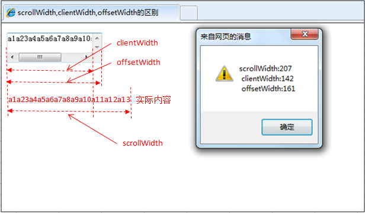

# 前端面试 - 基础题

## 目录
- [面试问题](#面试问题)

### JavaScript 相关

- [典型的JavaScript面试题](#典型的JavaScript面试题)
- [Q: 如何实现一个 bind 函数](#q-如何实现一个-bind-函数)
- [Q: 如何实现一个 call 函数](#q-如何实现一个-call-函数)
- [Q: 如何实现一个 apply 函数](#q-如何实现一个-apply-函数)
- [Q: window.onload 和 document.ready 的区别](#q-windowonload-和-documentready-的区别)
- [Q: 如何理解 V8 引擎字节码?](#q-如何理解-V8-引擎字节码?)
- [Q: cookie的主要应用场景](#q-cookie的主要应用场景)
- [Q: WebStorage 和 Cookie 的区别](#q-WebStorage-和-Cookie-的区别)
- [Q: sessionStorage 和 localStorage 的区别](#q-sessionStorage-和-localStorage-的区别)
- 
### 服务器相关

- [Q: 从输入URL到页面加载发生了什么？](#q-从输入url到页面加载发生了什么)
- [Q: 在浏览器地址栏键入URL，按下回车之后会发生什么？](#q-在浏览器地址栏键入url按下回车之后会发生什么)
- [Q: 将静态资源放在其他域名的目的是什么？](#q-将静态资源放在其他域名的目的是什么)
- [Q: 跨域问题](#q-跨域问题)
- [Q: GET 和 POST 的区别](#q-get-和-post-的区别)
- [Q: 前端渲染与后端渲染](#q-前端渲染与后端渲染)

### 页面布局相关

- [Q: mouseover 和 mouseenter 的区别](#q-mouseover-和-mouseenter-的区别)
- [Q: offsetWidth/offsetHeight、clientWidth/clientHeight 和 scrollWidth/scrollHeight 之间的区别](#q-offsetwidthoffsetheightclientwidthclientheight-和-scrollwidthscrollheight-之间的区别)
- [Q: setTimeout、setInterval 和 requestAnimationFrame 之间的区别](#q-settimeoutsetinterval-和-requestanimationframe-之间的区别)
- [Q: relative 和 absolute 分别是相对于谁进行定位的？](#q-relative-和-absolute-分别是相对于谁进行定位的)
- [Q: HTML5 行内元素有哪些，块级元素有哪些，空元素有哪些?](#q-html5-行内元素有哪些块级元素有哪些空元素有哪些?)
- [Q: HTML5 有哪些新特性?](#q-HTML5-有哪些新特性?)
- [Q: HTML5 的存储方案有哪些?](#q-HTML5-的存储方案有哪些?)
- [Q: native页面和H5页面的区别](#q-native页面和H5页面的区别)
- [Q: 什么是css盒模型](#q-什么是-css-盒模型?)

### 面试问题

1. 问清楚公司做的什么产品，以后的发展方向
2. 问清楚公司的技术团队，技术栈
3. 问清楚自己如果入职了，自己的工作内容是什么
4. 问清楚公司的上班时间，上班地点，试用期情况，薪资福利，薪资发放时间，五险一金
5. 拿到 offer 后查清楚公司的企业信息，如：企查查就可以查

### 典型的JavaScript面试题

```
(function() {
  var a = b = 5;
})();
console.log(b); // 输出：5

1. a是用关键字 var 来声明的，a是局部变量
2. b则被赋予为全局变量
3. 它并没有使用严格模式（use strict），如果启用了严格模式，代码就会报错："Uncaught ReferenceError: b is not defined"
4. 严格模式需要显式地引用全局作用域，如：
(function() {
'use strict';
  var a = window.b = 5;
})();
console.log(b); // 输出：5
```

```
function test() {
  console.log(a);
  console.log(foo());
  var a = 1;
  function foo() {
    return 2;
  }}
test(); // undefined 2

1. 变量和函数的声明都被提前至函数体的顶部
2. 变量并没有被赋值。虽然 a 已经被声明，但仍然是undefined
```

### Q: 如何实现一个 bind 函数

```
Function.prototype.myBind=function(obj,arg){
  var arg=Array.prototype.slice.call(arguments,1);
  var context=this;
  var bound=function(newArg){
    arg=arg.concat(Array.prototype.slice.call(newArg));
    return context.apply(obj,arg);
  }
  //寄生组合继承
  var F=function(){}
  F.prototype=context.prototype;
  bound.prototype=new F();
  return bound;
}

或者

Function.prototype.myBind = function (context) {
  if (typeof this !== 'function') {
    throw new TypeError('Error')
  }
  var _this = this
  var args = [...arguments].slice(1)
  // 返回一个函数
  return function F() {
    // 因为返回了一个函数，我们可以 new F()，所以需要判断
    if (this instanceof F) {
      return new _this(...args, ...arguments)
    }
    return _this.apply(context, args.concat(...arguments))
  }
}
```

### Q: 如何实现一个 call 函数

```
Function.prototype.myCall = function (context) {
  var context = context || window
  context.fn = this
  var args = [...arguments].slice(1)
  var result = context.fn(...args)
  delete context.fn
  return result
}
```

### Q: 如何实现一个 apply 函数

```
Function.prototype.myApply = function (context) {
  var context = context || window
  context.fn = this
  var result
  if (arguments[1]) {
    result = context.fn(...arguments[1])
  } else {
    result = context.fn()
  }
  delete context.fn
  return result
}
```

### Q: window.onload 和 document.ready 的区别

1. window.onload 是在页面中包含图片在内的所有元素全部加载完成
2. document.ready 是文档结构加载完成，但不包含图片，其他媒体文件
3. 在 jQuery 中会看到 $(function(){}) 和 $(document).ready(function(){})，是在DOM树加载完成之后执行
4. window.onload 是在DOM树加载完以及所有文件加载完成才执行，因此慢于document.ready
5. 当页面文档加载并解析完毕之后会马上触发 DOMContentLoaded 事件，而不会等待样式文件、图片文件和子框架页面的加载

### Q: 如何理解 V8 引擎字节码?

1. 当 V8 编译 JavaScript 代码时，解析器(parser)将生成一个抽象语法树
2. 语法树是 JavaScript 代码的句法结构的树形表示形式
3. 解释器 Ignition 根据语法树生成字节码
4. TurboFan 是 V8 的优化编译器，TurboFan 将字节码生成优化的机器代码


### Q: cookie的主要应用场景

1. 保持登录
2. 保持上次查看的页面
3. 浏览计数
4. 广告追踪
5. 购物车的状态保持

### Q: WebStorage 和 Cookie 的区别

1. cookie安全性问题(CSRF)
2. cookie会在http请求中传送，浪费带宽
3. cookie只有4kb，而webStorage有平均5mb的本地存储
4. cookie根据expires设置过期时间
5. cookie在同源下只要没过期就会一直共享，localStorage在同源中没被删除情况也会共享，sessionStorage在窗口关闭之前在同一个窗口同源下才能共享

### Q: sessionStorage 和 localStorage 的区别

1. 在 html5 中 WebStorage 包括两种存储方式```sessionStorage``` 和 ```localStorage```
2. sessionStorage是非持久化的本地存储，用于存储一个会话(session)中的数据，并且当会话结束后数据也随之销毁
3. localstorage是持久化的本地存储，除非主动删除数据，否则数据是永远也不过期的
4. localstorage和sessionStorage都具有相同的操作方法，例如setItem,getItem, clear和removeItem等
5. 对于object对象可以用JSON.stringfy进行转化然后存储，用的时候利用JSON.parse转化回来使用
6. 对于图片存储我们可以将图片转化为DataURI格式进行存储；具体转化方式可以借用canvas提供的toDataURL
7. 对于webstorage本地存储各浏览器支持也是不同，平均对每个源分配的存储大小大约5M

---

### Q: 从输入URL到页面加载发生了什么？

1. DNS解析
2. TCP连接
3. 发送HTTP请求
4. 服务器处理请求并返回HTTP报文
5. 浏览器解析渲染页面
6. 连接结束

### Q: 在浏览器地址栏键入URL，按下回车之后会发生什么？

1. 浏览器向 DNS 服务器请求解析该 URL 中的域名所对应的 IP 地址
2. 解析出 IP 地址后，根据该 IP 地址和默认端口 80，和服务器建立TCP连接
3. 浏览器发出读取文件的 HTTP 请求，该请求报文作为 TCP 三次握手的第三个报文的数据发送给服务器
4. 服务器对浏览器请求作出响应，并把对应的 html 文本发送给浏览器
5. 释放 TCP 连接
6. 浏览器解析渲染页面

### Q: 将静态资源放在其他域名的目的是什么？

1. 在请求这些静态资源的时候不会发送 cookie，节省了流量（ cookie 是会发送给子域名/二级域名的，所以这些静态资源要放在一个单独的主域名下）
2. 浏览器对于一个域名会有请求数的限制，这种方法可以方便做CDN

### Q: 跨域问题

1. 浏览器的同源策略导致了跨域
2. 用于隔离潜在恶意文件的重要安全机制
3. jsonp ，允许 script 加载第三方资源
4. nginx 反向代理（nginx 服务内部配置 Access-Control-Allow-Origin *）
5. cors 前后端协作设置请求头部，Access-Control-Allow-Origin 等头部信息
6. iframe 嵌套通讯，postmessage

### Q: GET 和 POST 的区别

1. GET 提交的数据会放在 URL 之后，以?分割 URL 和传输数据，参数之间以&相连，如EditPosts.aspx?name=test1&id=123456
2. POST 方法是把提交的数据放在 HTTP 包的 Body 中
3. GET 提交的数据大小有限制
4. POST 提交的数据没有限制
5. GET 方式需要使用 Request.QueryString 来取得变量的值
6. POST 方式通过 Request.Form 来获取变量的值
7. GET 方式提交数据，会带来安全问题，比如一个登录页面，通过GET方式提交数据时，用户名和密码将出现在URL上

### Q: 前端渲染与后端渲染

* 前端渲染的优势

1. 局部刷新
2. 懒加载
3. 富交互
4. 节约服务器成本
5. 关注分离设计
6. JS 一次学习，到处使用

* 前端渲染遇到的问题

1. 前端渲染主要面临的问题有两个 SEO、首屏性能
2. SEO：由于传统的搜索引擎只会从 HTML 中抓取数据，导致前端渲染的页面无法被抓取
3. 首屏性能：前端渲染常使用的 SPA 会把所有 JS 整体打包，无法忽视的问题就是文件太大，导致渲染前等待很长时间

* 后端渲染的优势

1. 服务端渲染不需要先下载一堆 js 和 css 后才能看到页面（首屏性能）
2. SEO
3. 服务端渲染不用关心浏览器兼容性问题
4. 对于电量不给力的手机或平板，减少在客户端的电量消耗很重要

* 后端渲染遇到的问题

1. 服务端优势其实只有首屏性能和 SEO 两点比较突出
2. 但现在这两点也慢慢变得微不足道了
3. React 这类支持同构的框架已经能解决这个问题

---

### Q: mouseover 和 mouseenter 的区别

1. mouseover: 当鼠标移入元素或其子元素都会触发事件，所以有一个重复触发，冒泡的过程。对应的移除事件是mouseout

2. mouseenter: 当鼠标移入元素本身（不包含元素的子元素）会触发事件，也就是不会冒泡，对应的移除事件是mouseleave

### Q: offsetWidth/offsetHeight、clientWidth/clientHeight 和 scrollWidth/scrollHeight 之间的区别

1. offsetWidth/offsetHeight 返回值包含 content + padding + border + 滚动条，效果与ele.getBoundingClientRect()相同
2. clientWidth/clientHeight 返回值只包含 content + padding，如果有滚动条，也不包含滚动条
3. scrollWidth/scrollHeight 返回值包含 content + padding + 溢出内容的尺寸(因滚动被隐藏的部分)

* offsetWidth / clientWidth / scrollWidth



* offsetParent / offsetLeft / offtsetTop


* clientLeft / clientTop (内部与外部的相对坐标 / border)


* scrollTop / scrollHeight

1. 元素的 scrollTop 值是这个元素的顶部到它的最顶部可见内容的顶部的距离的度量
2. 大多数几何结构属性都是只读的，但是 scrollLeft 和 scrollTop 是可更改的
3. 如果将 scrollTop 设置为 0 或 Infinity 将会使元素分别滚动到浏览器的最顶端和最底端


* 几何结构


```
#contentDiv {
  width: 300px;
  height: 200px;
  border: 25px solid #E8C48F;
  padding: 20px;
  overflow: auto;
}
1. 如果没有滚动条，内容（content）的 width 将是300px
2. 如果滚动条的宽度是16px（不同的设备和浏览器的宽度不同），那么内容的 width 将是300 - 16 = 284px
3. 那么 clientWidth = 2 * padding + width = 2 * 20 + 284 = 324
```

### Q: setTimeout、setInterval 和 requestAnimationFrame 之间的区别

1. 与 setTimeout 和 setInterval 不同，requestAnimationFrame 不需要设置时间间隔
2. requestAnimationFrame 采用的是系统时间间隔，不会因为前面的任务而受到影响
3. setTimeout 和 setInterval 真正运行时的时间间隔会因为前面的任务而受到影响
4. requestAnimationFrame 会把每一帧中的所有DOM操作集中起来，在一次重绘或回流中就完成，并且重绘或回流的时间间隔紧紧跟随浏览器的刷新频率
5. 在隐藏或不可见的元素中，requestAnimationFrame 将不会进行重绘或回流，这当然就意味着更少的CPU、GPU和内存使用量
6. requestAnimationFrame 是由浏览器专门为动画提供的API，在运行时浏览器会自动优化方法的调用，并且如果页面不是激活状态下的话，动画会自动暂停，有效节省了CPU开销

### Q: relative 和 absolute 分别是相对于谁进行定位的？

1. absolute: 相对于最近一级的定位不是 static 的父元素来进行定位
2. fixed: 相对于浏览器窗口或 frame 进行定位
3. relative: 相对于其在普通流中的位置进行定位
4. static: 没有定位，元素出现在正常的流中
5. sticky: 容器的位置根据正常文档流计算得出

### Q: HTML5 行内元素有哪些，块级元素有哪些，空元素有哪些?

1. 行内元素有：a、span、button、input、select、textarea、i、em、strong
2. 块级元素
    - 2.1. 布局类: div、section、header、footer、aside、nav、article等
    - 2.2. 列表类: ul、li、ol
    - 2.3. form、p、table、标题h1~h6

### Q: HTML5 有哪些新特性?

1. 语义化标签: header、footer、nav、aside、article、section 等
2. 增强表单: 为 input 增加 color、email、date、range 等类型
3. 存储方面: 提供了 sessionStorage 、localStorage 和离线存储
4. 多媒体方面: 规定了音频和视频元素audio和video
5. 还有地理定位、canvas画布、拖放、多线程编程的 web workers 和 websocket 协议

### Q: HTML5 的存储方案有哪些?

1. HTML5提供了 sessionStorage、localStorage 和 离线存储
2. sessionStorage 和 localStorage 都是采用键值对的形式存储，通过 setItem、getItem、removeItem 来实现增删查改
3. sessionStorage 是会话存储，当浏览器关闭之后，自动清空
4. localStorage 没有时间上的限制，当浏览器关闭之后，不会自动清空
5. 离线存储用来确保 web 应用能够在离线情况下使用，通过在html标签中属性manifest来声明需要缓存的文件
6. manifest 文件声明的缓存文件可在初次加载后缓存在客户端，可以通过更新这个 manifest 文件来达到更新缓存文件的目的

### Q: native页面和H5页面的区别

* native页面

优势：
1. 运行速度比较快
2. 能使用设备的底层功能，如摄像头、方向传感器、重力传感器、拨号、GPS、语音、短信、蓝牙等
3. 在界面设计、功能模块、操作逻辑等层面相较 web 更易做到 App 的便捷性和舒适性，功能更加强大
4. 节省流量

劣势：
1. 不同的操作系统（如 Android 和 iOS）需要独立的进行开发
2. 每次有更新，都需要重新打包一次发布到应用平台上，且每次要向各个应用商店进行提交审核。之后用户需要手动进行点击更新安装（安装成本较高）
3. 开发成本比较高，尤其需要适配各种机型时（如 Android 应用，需要适配各种 Android 手机）

* H5 页面

优势：
1. 由于是运行在浏览器上，所以只需要开发一次便可以在不同的操作系统上显示
2. 迭代版本时，不需要打包便可以发布（实时更新、快速迭代），与云端实现实时数据交互
3. 开发成本相对较低，对浏览器的适配较简单，且发布门槛相对较低

劣势：
1. 每次打开页面，都得重新加载，获取数据
2. 过于依赖网络，速度无法保证。特别在弱网环境下，不仅耗费流量而且加载缓慢，就算是 WiFi 情况下也不容乐观
3. 只能使用有限的设备底层功能（无法使用摄像头、方向传感器、重力传感器、拨号、GPS、语音、短信、蓝牙等功能）
4. 仍处于发展阶段，部分功能无法在基于现有技术的浏览器基础上实现，且无法全面的显示最完美的用户体验，只能用现有技术去弥去找最佳解决方案

### Q: 什么是 css 盒模型?

* 标准盒子模型


* IE盒子模型


1. CSS中的盒子模型包括 IE盒子模型 和 标准的W3C盒子模型
2. box-sizing 有3个值：border-box, padding-box, content-box
3. 在标准盒子模型中，width指 content 部分的宽度
4. 在IE盒子模型中，width表示 content+padding+border 这三个部分的宽度
5. CSS3中引入了 box-sizing 属性，box-sizing:content-box;表示标准的盒子模型，box-sizing:border-box;表示的是IE盒子模型

---
